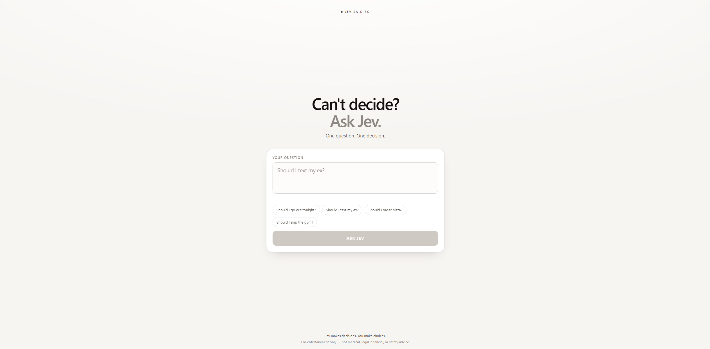

# Jev Said So

A tiny website that makes yes/no decisions for you using Jev.

Live: **https://jevsaidso.com**

Ask a question like *"Should I text my ex?"*, press **ASK JEV**, and get a verdict
with a confidence score.



## How it works

```
Question
   -> Vercel server function  (/api/ask)
   -> TypeSafe Jev            (jev-latest)
   -> YES / NO + confidence
```

The browser never talks to TypeSafe directly. It posts the question to our own
server function, which holds the API key, asks Jev, and normalizes the answer.

## Features

- **Yes/no decisions** — one question in, one verdict out, no signup
- **Confidence percentage** — Jev's probability, always read as confidence in the
  verdict you are shown (never below 50%)
- **Real Jev API** — TypeSafe's `jev-latest` model, not a mocked or random answer
- **Server-side API key** — the TypeSafe credential never reaches the browser
- **Rate limiting** — 10 questions per IP per minute, enforced in Redis so it holds
  across serverless instances
- **Responsive UI** — one screen, works down to small phones
- **Share button** — uses the Web Share API, falls back to copying text

## Stack

- React
- TypeScript
- Vite
- Vercel Functions
- TypeSafe Jev API
- Upstash Redis (rate limiting)

## Architecture

```
Browser  ->  POST /api/ask  ->  Vercel Function
                                   |-> Upstash Redis   (rate limit check first)
                                   |-> TypeSafe Jev    (only if allowed)
                                   ->  { answer, probability }
```

Rate-limit checks are skipped when a request carries a valid `x-benchmark-token`
header (see [Private benchmark harness](#private-benchmark-harness)); everything
else about such a request is identical.

- `api/ask.ts` — Vercel Function entry point
- `api/_lib/ask.ts` — validation, TypeSafe call, verdict normalization
- `api/_lib/rate-limit.ts` — Upstash-backed rate limiter and client IP handling
- `api/_lib/benchmark.ts` — private benchmark-token bypass
- `api/_lib/headers.ts` — shared request-header helpers
- `src/lib/decision.ts` — browser API layer (calls `POST /api/ask`)
- `scripts/dev-server.mjs` — local Vite + `/api/ask`, no Vercel CLI needed
- `scripts/benchmark.ps1` — 100-question prompt regression harness

Rate limiting runs **before** the TypeSafe call, so a rejected request costs
nothing. If Upstash is unreachable the endpoint fails open rather than taking the
product down.

### `POST /api/ask`

```jsonc
// request
{ "question": "Should I go out tonight?" }

// 200
{ "answer": "YES", "probability": 0.82, "mocked": false }

// 429
{ "error": "Too many questions. Try again in a minute." }
```

`probability` is confidence in `answer`, between 0 and 1.

Status codes: `400` invalid input, `405` non-POST, `429` rate limited,
`502` upstream failure, `503` missing key. Error bodies are always
`{ "error": "..." }` and never include upstream detail or credentials.

## Local development

```bash
npm install
npm run dev        # http://localhost:5173 — app + the real /api/ask endpoint
npm run dev:vite   # frontend only (no /api; shows the retry state)
npm run build      # type-check + production bundle into dist/
npm run preview    # serve the production build (static only, no /api)
npm run lint       # eslint
npm test           # server-side API and rate-limit tests (no network)
```

### Environment variables

Copy `.env.example` to `.env.local` (git-ignored) and fill in the values.

| Variable | Required | Purpose |
| -------- | -------- | ------- |
| `TYPESAFE_API_KEY` | yes | Server-side TypeSafe credential for Jev |
| `UPSTASH_REDIS_REST_URL` | production | Upstash Redis REST endpoint |
| `UPSTASH_REDIS_REST_TOKEN` | production | Upstash Redis REST token |
| `TYPESAFE_BASE_URL` | no | Test-only override pointing at a mock upstream |
| `BENCHMARK_BYPASS_TOKEN` | no | Private token that lets the benchmark harness skip the rate limit |

All of these are **server-side only**. None are prefixed with `VITE_`, and none are
imported into `src/` — anything `VITE_`-prefixed is bundled into client JavaScript
and would be public.

Upstash is optional locally: without it, `/api/ask` runs unlimited so development
and tests stay usable. In production it is required, otherwise the rate limit is
inactive.

## Production setup

1. Set `TYPESAFE_API_KEY` in Vercel → Project Settings → Environment Variables.
2. Create a Redis database at [console.upstash.com](https://console.upstash.com)
   and copy its REST URL and token.
3. Add them to Vercel as `UPSTASH_REDIS_REST_URL` and `UPSTASH_REDIS_REST_TOKEN`.
4. Redeploy so the new variables take effect.

## Testing

Server-side unit and integration tests: `npm test`. There is also a live prompt
regression harness — see [Private benchmark harness](#private-benchmark-harness).

`npm test` never calls TypeSafe or Upstash — the upstream is stubbed, so no API
credits are used. Coverage includes request validation, the TypeSafe request
shape, YES/NO normalization, generic upstream error handling, and rate limiting
(below limit, over limit, and that a blocked request never reaches TypeSafe), and
the private benchmark bypass (valid token, wrong token, and disabled bypass).

## Private benchmark harness

`scripts/benchmark.ps1` runs 100 fixed yes/no questions against `/api/ask` and
saves every Jev output, so prompt changes can be compared run to run.

The question set is hard-coded on purpose: future runs must ask the exact same
questions for results to be comparable. It covers English, Turkish, Turkish
without Turkish characters, mixed Turkish-English, slang, typos, and paired
cases where a single fact changes.

```powershell
$env:JEV_BENCHMARK_TOKEN = "the-secret-token"
.\scripts\benchmark.ps1
```

Results land in `benchmarks/jev-<timestamp>.csv` and `.json`; runs never
overwrite each other. The CSV opens directly in Excel (UTF-8 with BOM, so
Turkish characters survive). The script prints a per-question table and a
summary with YES/NO counts, mean and median confidence, latency, and how the
results lined up with the `Expected` column.

Useful flags: `-Endpoint` (default `https://jevsaidso.com/api/ask`),
`-Tag`, `-DelayMs`, `-TimeoutSec`, `-OutputDir`.

```powershell
# Local run against the dev server
.\scripts\benchmark.ps1 -Endpoint "http://localhost:5173/api/ask" -Tag "local"
```

### Enabling the bypass

100 requests would trip the public limit (10 per 60 s per IP) after the first
ten, so the harness sends an `x-benchmark-token` header that skips **only** the
rate-limit check. Validation and the TypeSafe call still happen normally.

The token lives in `JEV_BENCHMARK_TOKEN` locally and must match
`BENCHMARK_BYPASS_TOKEN` on the server. Never commit it.

1. Generate a long random value.
2. Add it to Vercel → Project Settings → Environment Variables →
   `BENCHMARK_BYPASS_TOKEN` (**Production**).
3. Redeploy — environment changes only apply to new deployments.
4. Set the same value locally: `$env:JEV_BENCHMARK_TOKEN = "..."`.

If `BENCHMARK_BYPASS_TOKEN` is unset or empty the bypass is disabled and every
request is rate limited like a public one. A wrong token behaves exactly like an
ordinary request — the public limit is never weakened.

### A note on the numbers

The `Expected` column (YES / NO / AMBIGUOUS) is our own annotation, is never
sent to Jev, and is only there to catch obvious regressions. Directional
agreement here is a prompt smoke test, not a scientific accuracy benchmark. A
run without `JEV_BENCHMARK_TOKEN` will show mostly HTTP 429 rows — that is the
limit working, not a failure of the harness.

## Vibe coded

This project was vibe coded with AI coding agents as a fun experiment.

I directed the product, behavior, testing, debugging, deployment, and iterations
while the agents helped write much of the implementation. Every decision about
what this thing should be — and whether it actually works — came from a human
saying "no, try again".

## Disclaimer

For entertainment only. Not medical, legal, financial, or safety advice. Jev is a
language model with opinions, not an oracle.
